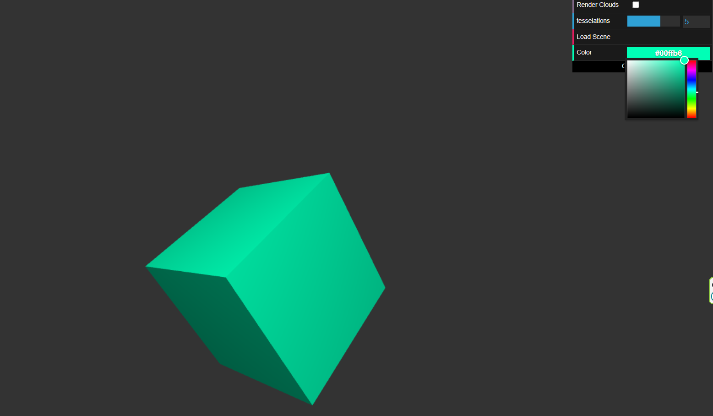
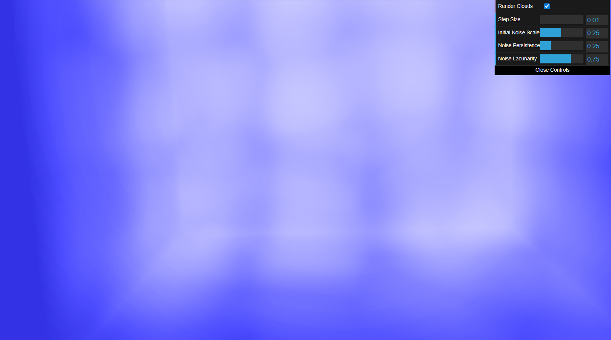

# HW 0: Intro to Javascript and WebGL

## Images

### Cube w/ Color Picker

### Cloud Rendering

## Live Demo Link
https://ldooley-penn.github.io/hw00-intro-base/

## Overview
For this assignment I have added a color picker to the GUI 
with label "Color". 
I created a cube class and replaced the rendered sphere with it.
I also have modified the lambert vertex shader to take in a time
uniform and oscillate the cube around the screen based on the transform
(sin(time), cos(time), sin(time) * cos(time)).

For the noise part of the assignment, I chose to implement
voronoi noise with FBM in three dimensions, and raymarch through it 
using a fullscreen quad shader to mimic elementary cloud rendering.
This can be enabled via the checkbox "Render Clouds". Enabling
this checkbox will change the GUI options to include a 
"Step Size" parameter for ray marching. The camera is still able to be
rotated, but I fixed the camera position in the shader itself.

## Cloud Rendering Implementation Details
### Raymarching setup
To render clouds with raymarching, I first used the Square class
alongside a new set of shaders, noise-vert.glsl and noise-frag.glsl
to render a full-screen quad. The vertex shader was kept quite simple,
but in the fragment shader, I used gl_FragCoord along with the window's
aspect ratio I put in, and assumed an FOV of 1 radian to distribute 
rays coming from the camera towards each pixel.

My getCloudColor function calls another which raymarches through 
my noise function, but slightly different than normal raymarching.
Since I am using the noise to represent cloud density, instead of 
an sdf, I have a fixed step size for rays to travel. As the ray
marches each step, it integrates the cloud density at each position,
and finally uses that value to calculate a transmittance using an
inverse exponential. This vaguely mimics how much light passes through
clouds of each density.

Another important note is that the cloud volume is limited to a
unit cube centered at the origin, so that you can actually see through
parts of it to reveal its shape. If the clouds stretched on forever,
you would eventually accumulate infinite density and see no
cloud shapes anymore.

One limitation of this fixed step-size raymarching variant is that
it creates artifacts when the step size is large enough, revealing
the discretization of the process. In the end it is a trade off of
performance and image quality, but some optimisations could have been
made for example if the noise was calculated offline and stored in a
texture.

### Noise Implementation
For generating cloud-like shapes, I opted to use voronoi noise, since
it mimics the sort of blobby shapes that clouds have. To implement
this, at a base line I required a 3D -> 3D noise function, which
would be used to place "centers" in each cell for the voronoi noise.
I used some online resources to find the best setup for this which
suited my needs, and linked the appropriate source in the shader.

At a higher level, to implement voronoi noise, I would take a position,
scale it depending on the scale of noise I desired, and searched its
27 surrounding neighbor "cells" to see which of their centers was the
closest. Then I would return the closest distance of the current position
to a neighbor cell's center.

### FBM Usage
I also used FBM to generate multiple octaves of noise, but in a
different way than normal. I used the lowest frequency noise as normal,
but instead of adding on higher frequencies, I instead subtracted
them from the total noise. I thought that this better suited clouds since
I feel like you often see clouds with lots of concave divots in the larger
convex blobs, which is what this mimics.